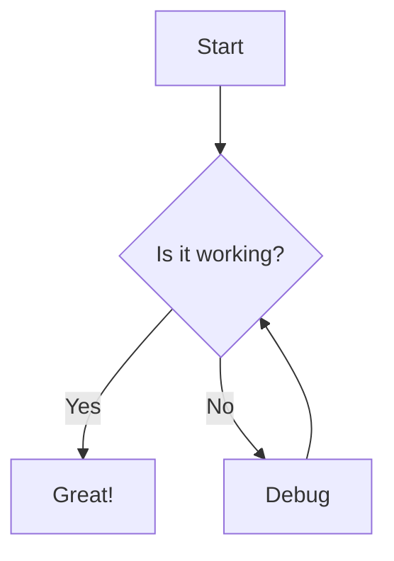
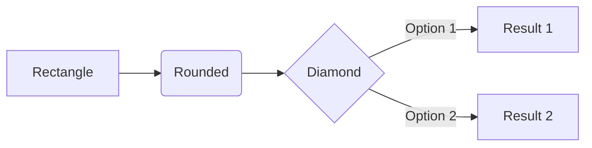
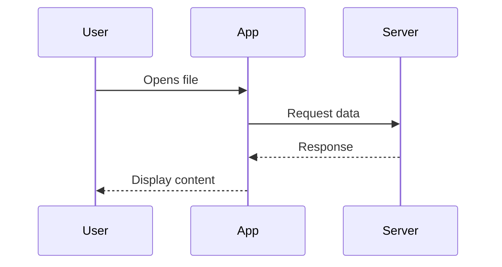
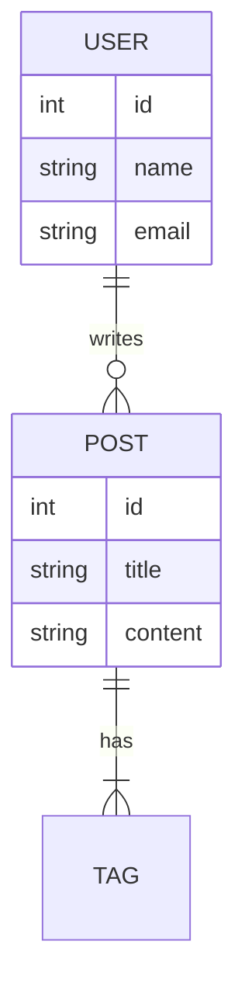
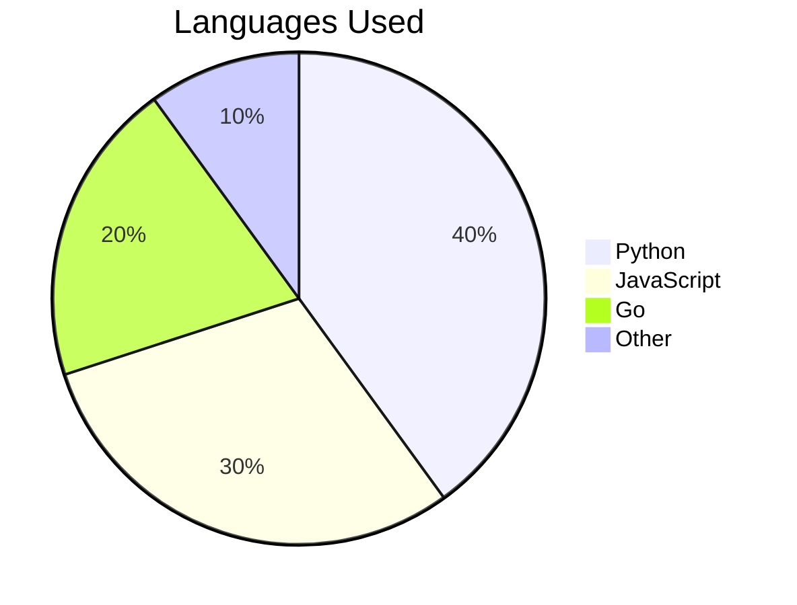
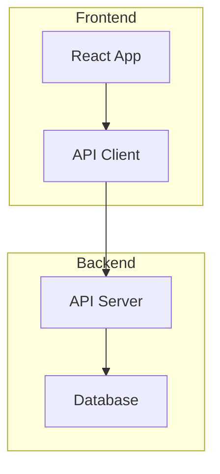

# How to Render Mermaid Diagrams in Markdown

Mermaid is a powerful tool that lets you create diagrams and visualizations using plain text inside Markdown files. Instead of using a separate drawing tool, you describe the diagram in a simple syntax and it gets rendered automatically.

This guide covers how to write Mermaid diagrams and how to view them on your Mac.

## What Is Mermaid?

Mermaid is a JavaScript-based diagramming tool that turns text descriptions into diagrams. It supports:

- **Flowcharts** — Process flows and decision trees
- **Sequence diagrams** — Interactions between systems or people
- **ER diagrams** — Database entity relationships
- **Pie charts** — Simple data visualization
- **State diagrams** — State machines and transitions
- **Gantt charts** — Project timelines
- **Git graphs** — Branch and merge visualizations

The best part? It's all written as plain text in your Markdown file.

## Basic Syntax

Mermaid diagrams are written inside fenced code blocks with the `mermaid` language identifier:

````markdown

````

This creates a simple flowchart with a decision point.

## Flowcharts

Flowcharts are the most common Mermaid diagram type. They support different node shapes and arrow styles:

````markdown

````

- `TD` = top to bottom, `LR` = left to right
- `[ ]` = rectangle, `( )` = rounded, `{ }` = diamond
- `-->` = arrow, `-->|text|` = labeled arrow

## Sequence Diagrams

Perfect for showing API calls or user interactions:

````markdown

````

## ER Diagrams

Great for documenting database schemas:

````markdown

````

## Pie Charts

Simple data visualization:

````markdown

````

## How to View Mermaid Diagrams on Mac

The challenge with Mermaid diagrams is that not every Markdown tool renders them. Here are your options:

### Option 1: Simply Markdown (Recommended)

[Simply Markdown](https://apps.apple.com/app/simply-markdown/id6760895817) renders Mermaid diagrams natively. Just open your `.md` file and all diagrams are rendered automatically. With live reload, you can edit your Mermaid code in any text editor and see the diagram update in real time.

Supported diagram types: flowcharts, sequence diagrams, ER diagrams, pie charts, state diagrams, and more.

### Option 2: GitHub

GitHub renders Mermaid diagrams in Markdown files, README files, issues, and comments. If your files are on GitHub, they'll render automatically. But you can't preview them locally before pushing.

### Option 3: VS Code Extensions

Extensions like "Markdown Preview Mermaid Support" add Mermaid rendering to VS Code's built-in Markdown preview. This works but keeps you inside the editor.

### Option 4: Mermaid Live Editor

The online Mermaid Live Editor at mermaid.live lets you write and preview diagrams in a browser. Good for experimenting, but not practical for viewing diagrams embedded in your Markdown files.

## Tips for Writing Mermaid Diagrams

1. **Start simple** — Get the basic structure right, then add detail
2. **Use comments** — Add `%% This is a comment` for notes
3. **Keep it readable** — Break long diagrams into sub-graphs
4. **Use meaningful IDs** — `UserService` is better than `A`
5. **Test incrementally** — With live reload, add nodes one at a time

## Subgraphs for Complex Diagrams

For larger diagrams, subgraphs help organize sections:

````markdown

````

## Conclusion

Mermaid diagrams are a fantastic way to keep documentation close to your code — no separate drawing tools needed. All you need is a Markdown viewer that supports them.

[Download Simply Markdown](https://apps.apple.com/app/simply-markdown/id6760895817) to start viewing Mermaid diagrams on your Mac today.
