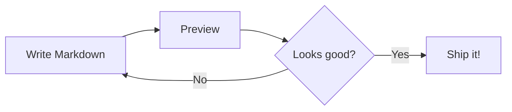

# Markdown Cheat Sheet: Complete Guide with Examples

Markdown is the most popular lightweight markup language for writing formatted text. Whether you're writing documentation, README files, notes, or blog posts — this cheat sheet covers everything you need.

## Headings

Use `#` symbols to create headings. More `#` symbols = smaller heading.

```markdown
# Heading 1
## Heading 2
### Heading 3
#### Heading 4
##### Heading 5
###### Heading 6
```

## Text Formatting

```markdown
**Bold text**
*Italic text*
***Bold and italic***
~~Strikethrough~~
`Inline code`
```

**Bold text**, *Italic text*, ***Bold and italic***, ~~Strikethrough~~, `Inline code`

## Links and Images

```markdown
[Link text](https://example.com)
[Link with title](https://example.com "Title")


```

## Lists

### Unordered Lists

```markdown
- Item 1
- Item 2
  - Sub-item 2a
  - Sub-item 2b
- Item 3
```

### Ordered Lists

```markdown
1. First item
2. Second item
3. Third item
   1. Sub-item
   2. Sub-item
```

### Task Lists (GFM)

```markdown
- [x] Completed task
- [ ] Incomplete task
- [ ] Another task
```

## Blockquotes

```markdown
> This is a blockquote.
>
> It can span multiple lines.

> Nested blockquotes
>> are also possible.
```

## Code

### Inline Code

```markdown
Use `console.log()` to print output.
```

### Code Blocks

Use triple backticks with an optional language identifier for syntax highlighting:

````markdown
```python
def hello(name):
    return f"Hello, {name}!"

print(hello("World"))
```
````

Popular language identifiers: `python`, `javascript`, `typescript`, `swift`, `go`, `rust`, `java`, `html`, `css`, `sql`, `bash`, `json`, `yaml`

## Tables

```markdown
| Feature | Free | Pro |
|---------|:----:|:---:|
| Basic editing | Yes | Yes |
| Export to PDF | No | Yes |
| Custom themes | No | Yes |
```

Alignment:
- `:---` = left-aligned
- `:---:` = center-aligned
- `---:` = right-aligned

## Horizontal Rules

```markdown
---
***
___
```

All three produce a horizontal line.

## Footnotes (GFM)

```markdown
Here is a statement with a footnote.[^1]

[^1]: This is the footnote content.
```

## Math Equations (KaTeX)

For Markdown viewers that support KaTeX:

### Inline Math

```markdown
The equation $E = mc^2$ is famous.
```

### Display Math

```markdown
$$
\frac{-b \pm \sqrt{b^2 - 4ac}}{2a}
$$
```

### Common Math Expressions

```markdown
$$\sum_{i=1}^{n} x_i$$          % Summation
$$\int_0^\infty e^{-x} dx$$     % Integral
$$\frac{a}{b}$$                   % Fraction
$$\sqrt{x^2 + y^2}$$             % Square root
$$\begin{bmatrix} a & b \\ c & d \end{bmatrix}$$  % Matrix
```

## Mermaid Diagrams

For Markdown viewers that support Mermaid:

````markdown

````

## Escaping Characters

Use a backslash to display literal characters:

```markdown
\* Not italic \*
\# Not a heading
\[Not a link\]
```

## HTML in Markdown

Most Markdown renderers support inline HTML:

```markdown
<details>
<summary>Click to expand</summary>

Hidden content here.

</details>

<kbd>Ctrl</kbd> + <kbd>C</kbd> to copy.
```

## Best Practices

1. **Use blank lines** between different elements (headings, paragraphs, lists)
2. **Be consistent** with list markers (use `-` or `*`, not both)
3. **Add alt text** to images for accessibility
4. **Use fenced code blocks** with language identifiers for syntax highlighting
5. **Keep lines reasonable** — long lines are harder to read in source

## Viewing Markdown on Mac

To see your Markdown files rendered beautifully with all these features — including tables, code highlighting, math equations, and Mermaid diagrams — try [Simply Markdown](https://apps.apple.com/app/simply-markdown/id6760895817). It's a free, native macOS viewer that supports the full Markdown spec plus KaTeX and Mermaid.

[Download Simply Markdown from the Mac App Store](https://apps.apple.com/app/simply-markdown/id6760895817)
